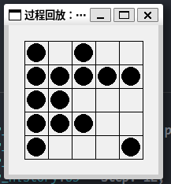
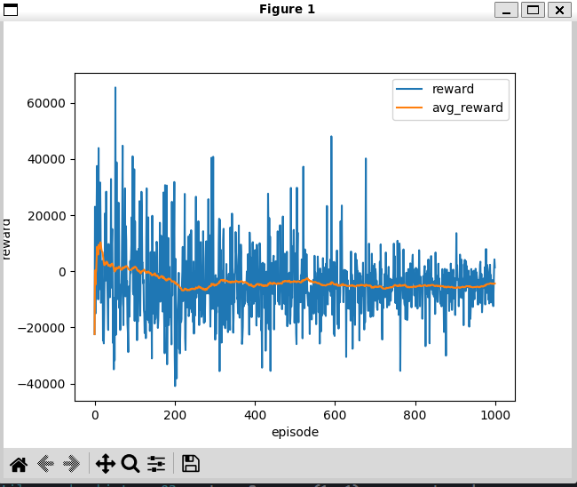
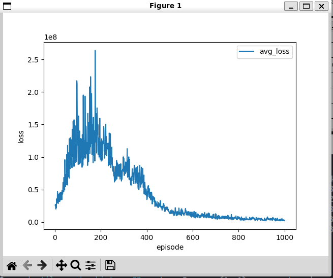

# 课程设计：DQN-五子棋 笔记-1


## 现在的情况

- 任务环境： 鼓励智能体在一个 `5x5` 的棋盘上落子，每次成功落子则给予奖励 `reward` ，如果智能体选择要落子的位置上已有棋子，则给予惩罚（为负数的 `reward` ）。
- 使用的算法：
  - `Double-DQN`：使用两个相同结构的网络（`在线网络`、`目标网络`）来估计 `Q` 值。在线网络用于选择当前的动作；目标网络用于计算下一个状态的最大 `Q` 值。
  - `Experience Replay 经验回放`：打破样本数据之间在时间上的相关性，将样本储存到经验池中，并按照某种规则从中采样并进行学习。

## 遇到的问题

个人感觉五子棋的激励函数比较难设计，所以先从一个简单的情形入手：训练一个不会反复在同一个位置落子的智能体，`5x5` 棋盘上只有一方棋手落子，每轮训练可下 25 个棋子，即最理想情况是刚好下满整个棋盘。

- 网络输入：一维张量，表示棋盘上 25 个落子位置，0 表示无落子，1 表示已落子。
- 网络输出：一维张量，表示棋盘上 25 个位置的落子行为。

$$
reward = \left\{\begin{matrix} 
   10 ^ {\log_{2}{num\_chess} } & \text{if    落子有效且棋盘未满} \\ 
   10 ^ {10} & \text{if    落子有效且棋盘已满} \\ 
   -1 \times 10^{\log_{2}{num\_chess} } & \text{if    落子无效} \\
\end{matrix}\right. 
\\
\text{num\_chess: 棋盘上的棋子数}
$$

```python
class QNetwork(nn.Module):
    def __init__(self, state_size=25, action_size=25, hidden_dim=64):
        super(QNetwork, self).__init__()
        self.fc1 = nn.Linear(state_size, hidden_dim)
        self.fc2 = nn.Linear(hidden_dim, hidden_dim) 
        self.fc3 = nn.Linear(hidden_dim, action_size)

    def forward(self, x):
        x = torch.relu(self.fc1(x))
        x = torch.relu(self.fc2(x))
        x = self.fc3(x)
        return x
```

在训练前期，探索率较高的阶段，智能体获得的奖励居多，随着探索率降低，智能体获得的惩罚超过了奖励，模型没有向理想的效果收敛。




每轮训练的平均loss

