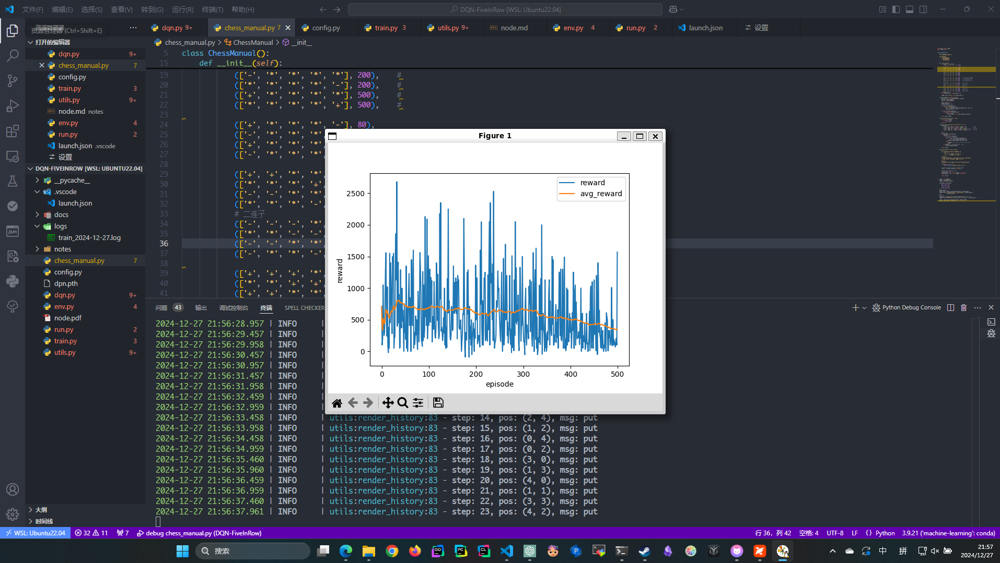
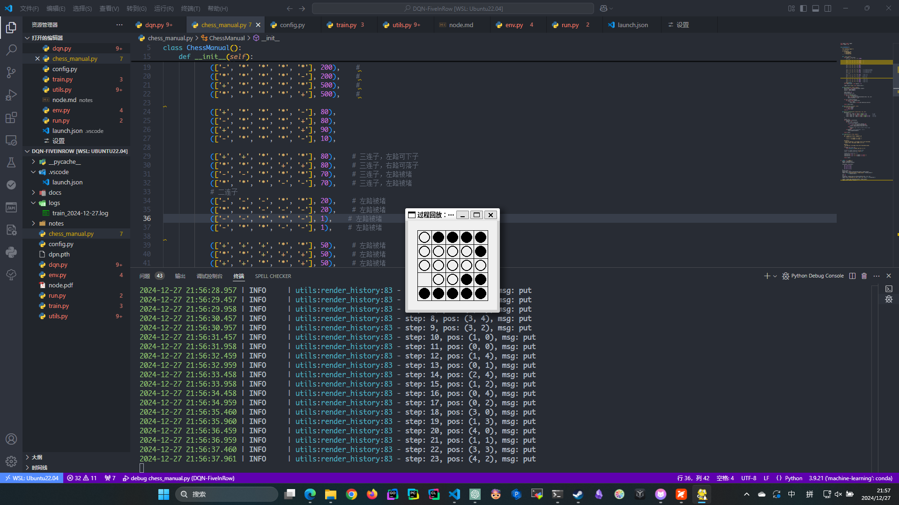

```python
class Config:
    def __init__(self):
        self.seed = 1               # 随机数种子
        self.num_episodes = 500     # 训练轮次
        self.max_step = 200         # 每轮训练的最大步数
        # ϵ−greedy 策略
        self.eps_start = 0.999   # 最大探索率
        self.eps_end = 0.05     # 最小探索率
        self.eps_decay = 0.997    # 探索率的衰减率
        # DQN 经验回放
        self.memory_capacity = 1000  # 经验池大小
        self.batch_size = 64         # 每次学习时从经验池采用的样本数
        # DQN 网络
        self.discount_factor = 0.99            # 折扣因子，代表对未来奖励的预期
        self.learning_rate = 0.05  # 学习率
        self.hidden_dim = 64       # 线性隐藏层的输入输出维度

        self.action_size = 25
        self.state_size = 25

        self.board_size = 5
        self.boost_rate = 0   # 短期的探索率增益比例
        self.bad_action_rate = 0.7

```